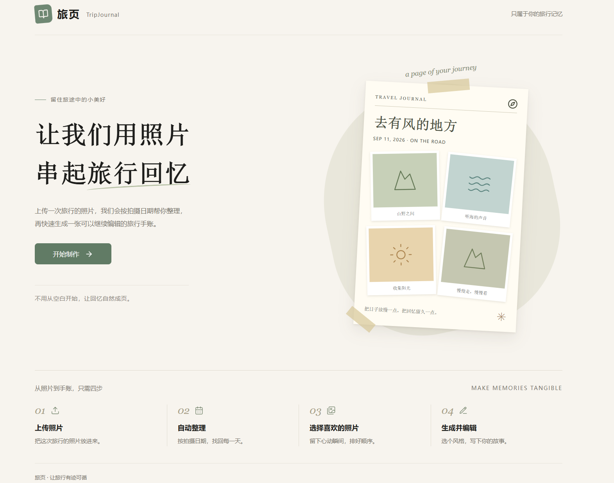
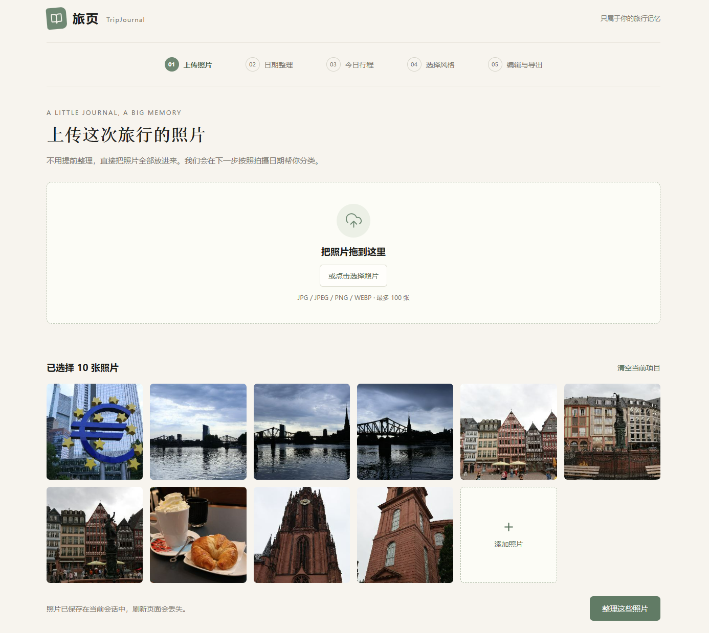
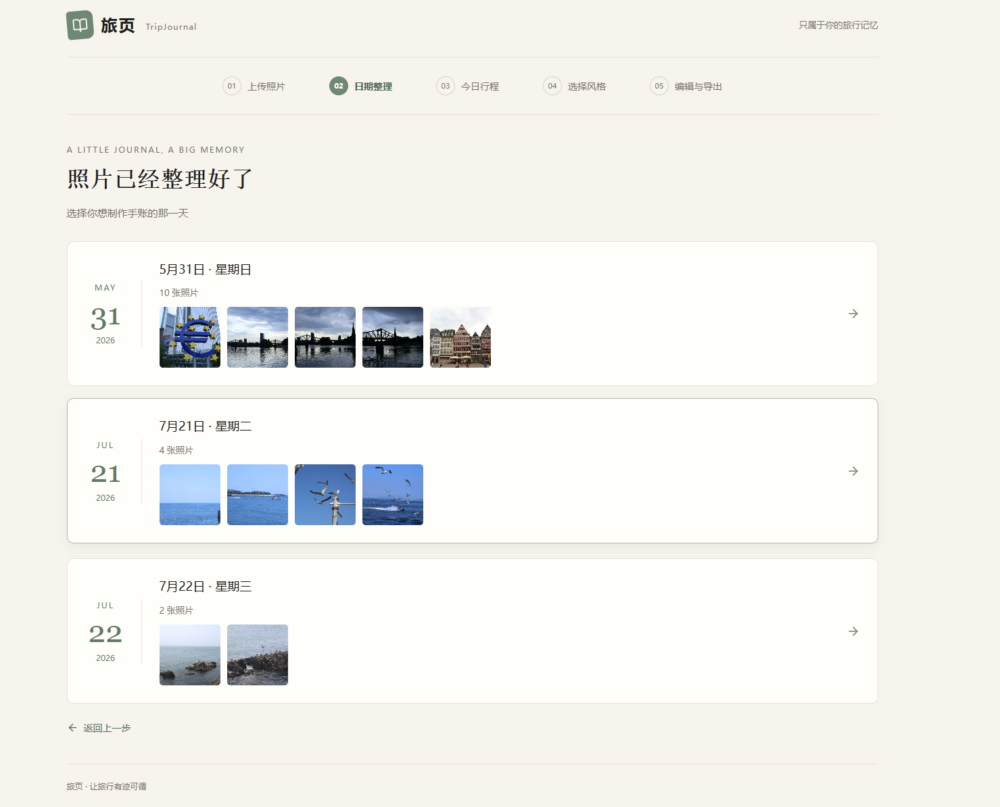
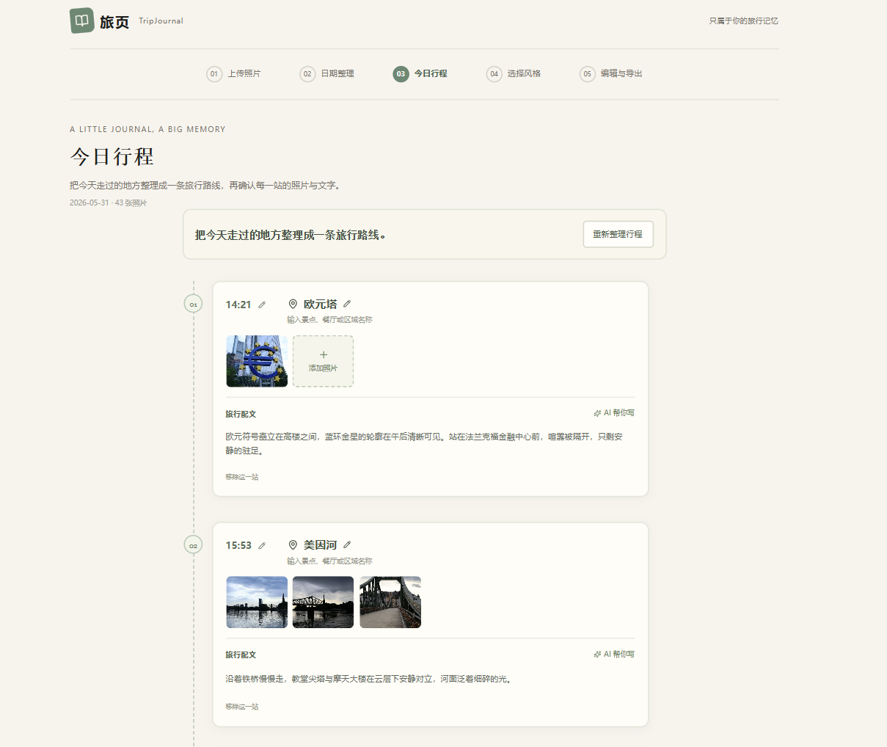
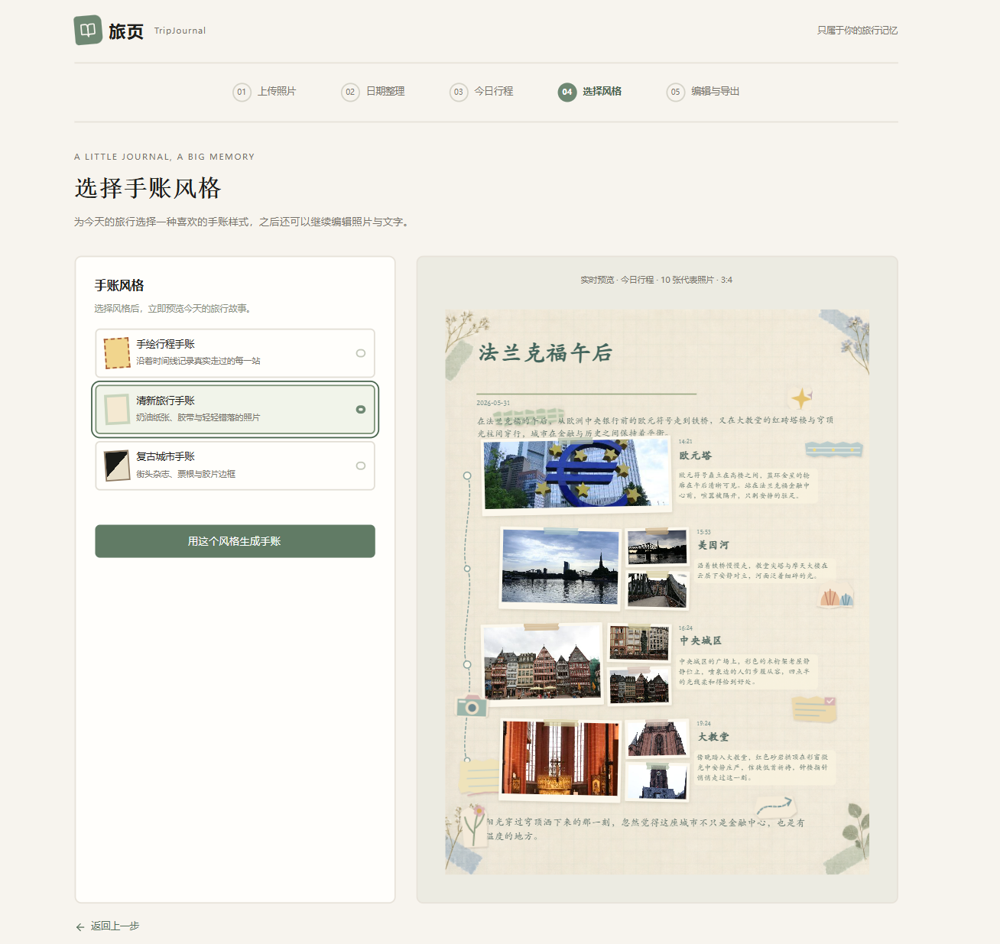
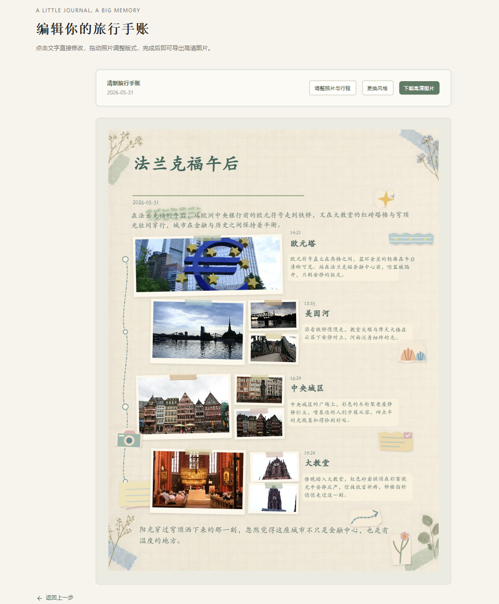

# TripJournal 旅页

TripJournal（旅页）是一款将旅行照片自动整理为可编辑电子手账的 Web App。

> 让我们用照片串起旅行回忆。

## 核心功能

### 📷 旅行照片整理

- 批量导入旅行照片
- 自动读取 EXIF 拍摄日期与位置信息
- 按日期整理照片
- 保留原始照片用于高清导出

### 🗺️ 今日行程

- 根据拍摄时间、位置与照片信息整理旅行站点
- 支持修改时间和地点
- 支持选择代表照片
- 支持新增、删除和调整站点

### ✨ AI 旅行配文

- 根据当前站点代表照片生成旅行手账文字
- 支持手动修改和重新生成
- 当前使用 Agnes Vision API

### 🎨 多种旅行手账风格

目前提供：

- 手绘行程手账
- 清新旅行手账
- 复古城市手账

### 🖼️ 可编辑手账画布

支持：

- 拖动照片
- 调整照片大小
- 调整裁切区域
- 使用模板预设的照片旋转效果
- 模板专属本地贴纸素材
- 贴纸拖动、缩放、旋转与删除
- 照片和贴纸的图层顺序调整
- 直接修改标题、地点、时间和旅行配文

系统先自动生成美观版式，再允许用户轻量微调，无需从空白画布开始设计。

### 📥 高清导出

- 1080 × 1440 手账画布
- PNG 导出
- 使用原始照片进行高清渲染

## 产品演示

TripJournal 将旅行照片从“相册里的零散记录”整理成一段完整的旅行故事。用户只需要上传照片，系统会根据拍摄信息整理日期与行程，并生成可以继续编辑和导出的电子旅行手账。

### 从照片到旅行手账

上传照片 → 按日期整理 → 自动整理行程 → 选择手账风格 → 编辑并导出



TripJournal 从“让我们用照片串起旅行回忆”出发，把旅行结束后散落在相册中的照片重新组织成可以阅读、编辑和保存的旅行记录。

---

### 01 上传旅行照片



直接导入一次旅行中的照片，无需提前整理。TripJournal 支持多图上传和本地照片预览，也能处理数量较多的旅行照片，并读取拍摄信息，为后续日期整理和行程恢复做准备。

---

### 02 自动按日期整理



系统根据照片拍摄日期自动分组，让用户先找回“哪一天去了哪里”，再选择其中一天继续制作旅行手账，把无序照片整理成按天阅读的旅行记录。

---

### 03 自动整理今日行程



在选定日期后，TripJournal 会根据照片的拍摄时间、位置信息和照片之间的变化自动整理旅行站点。每一站都可以继续确认和修改时间、地点、所属照片与旅行配文，也可以使用 AI 根据代表照片生成简短记录。

TripJournal 尝试从照片中恢复当天真实的旅行过程，而不是只把照片排列成一张拼图。

---

### 04 选择旅行手账风格



整理好行程后，可以实时预览并选择手绘行程手账、清新旅行手账或复古城市手账。照片、站点、时间和配文会自动进入手账版式，无需从空白画布开始设计。

---

### 05 编辑并导出



生成后仍然可以修改标题、地点和旅行配文，调整照片位置与版式、文字位置和文本框宽度，也可以更换手账风格并导出高清旅行手账图片。

产品希望让用户先得到一个完成度较高的结果，再进行轻量调整。

> TripJournal 希望做的不是另一款照片拼图工具，而是把相册中零散的照片重新还原成一段可以阅读、编辑和保存的旅行记忆。

## 技术栈

**Frontend**

- React 19
- TypeScript
- Vite
- Tailwind CSS
- React Router
- dnd-kit

**Photo Processing**

- exifr
- Canvas API
- Browser File / Blob API

**AI**

- Agnes Vision API
- agnes-2.5-flash

**Rendering**

- HTML / CSS / SVG
- Canvas
- 自定义手账场景渲染系统

## 本地运行

```bash
npm install
npm run dev
```

访问：[http://127.0.0.1:5173/](http://127.0.0.1:5173/)

AI 功能需要在项目根目录创建 `.env`：

```dotenv
AGNES_API_KEY=your_api_key
AGNES_MODEL=agnes-2.5-flash
AGNES_BASE_URL=https://apihub.agnes-ai.com/v1
```

## 项目状态

TripJournal 目前处于 MVP 阶段，照片整理、旅行行程、AI 配文、手账模板、可视化编辑和 PNG 导出等核心流程已经贯通。
